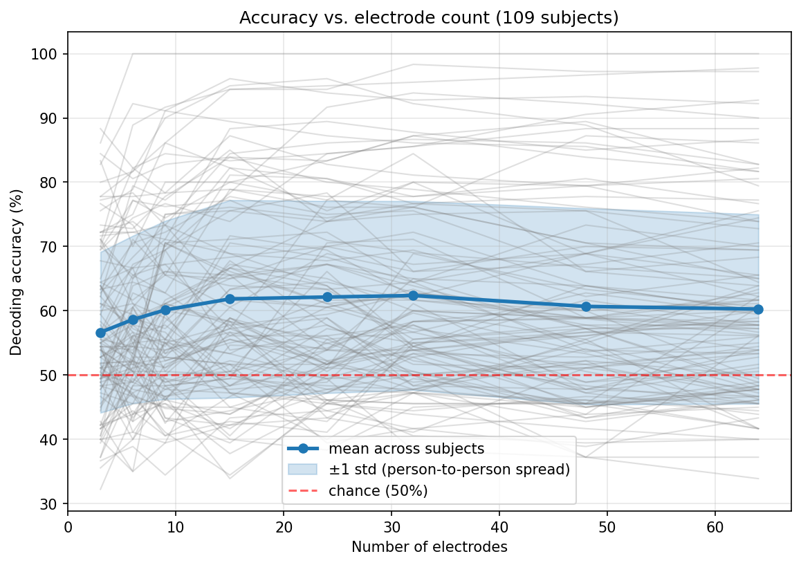

# Motor Imagery BCI: Channel Reduction and Subject Variability

Decoding imagined left- vs right-hand movement from EEG, across all 109 subjects
in the PhysioNet EEG Motor Movement/Imagery Dataset. This project asks two
questions: how few electrodes do you actually need, and how much does decoding
accuracy vary from person to person?

## Approach

- **Data:** PhysioNet EEGMMIDB, 64-channel EEG, 109 subjects, imagined left/right
  hand movement (runs 4, 8, 12).
- **Pipeline:** bandpass filter to the sensorimotor band (8-30 Hz), epoch into
  trials, then Common Spatial Patterns (CSP) for feature extraction and Linear
  Discriminant Analysis (LDA) for classification.
- **Evaluation:** repeated stratified 5-fold cross-validation, per subject.
- **Channel reduction:** electrodes ranked by distance from motor cortex
  (C3/Cz/C4 center); accuracy measured using the nearest N electrodes, swept from
  3 to 64.

## Findings

1. **Nine electrodes decode as well as 64.** Mean accuracy was 60.1% at 9
   electrodes vs 60.3% at 64. Accuracy plateaus by roughly 9-15 electrodes;
   adding more gives no meaningful improvement.

2. **The person matters far more than the hardware.** Individual best-case
   accuracy ranged from 47.8% to 100% (a 52-point spread), while changing the
   electrode count moved the average by about 2 points.

3. **Roughly a third of subjects were hard to decode.** 34 of 109 subjects
   (31%) never exceeded 60% accuracy at any electrode count, consistent with the
   documented "BCI illiteracy" phenomenon.

## Figure

Each gray line is one subject; the bold line is the mean; the band is ±1 standard
deviation across subjects.

## Running it
python -m venv venv
source venv/bin/activate
pip install mne numpy scipy scikit-learn matplotlib jupyter

Open the notebook and run top to bottom. The dataset downloads automatically from
PhysioNet on first run (it is not stored in this repo).

## Limitations and next steps

Each subject has only ~45 trials, so per-subject estimates are noisy. The pipeline
is a deliberately standard CSP+LDA baseline; a per-subject frequency-tuned method
(Filter Bank CSP) would likely recover some of the apparently "illiterate"
subjects, which is a natural next experiment.